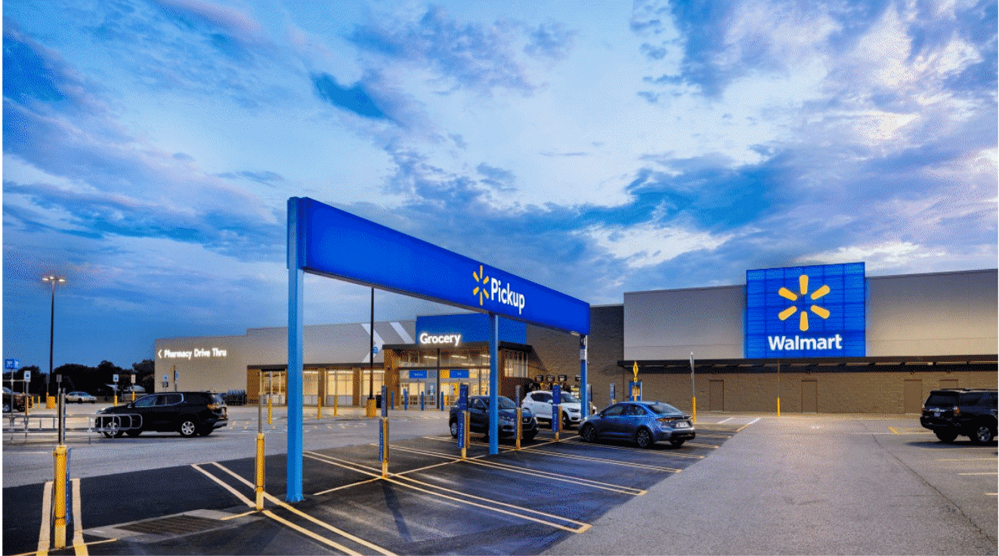

# 3 Brothers Retail

## Project Overview

This project involved creating a comprehensive Power BI dashboard to analyze sales performance and profit margins across multiple dimensions such as time, category, and region. The dashboard provides key performance indicators and visual insights that support informed decision-making for inventory, marketing, and distribution optimization. It highlights trends and discrepancies between sales growth and profit increases to guide strategic business improvements.

---

## Business Problem

3 Brothers Retail experienced a 77% increase in sales from 2019 to 2020, but profits only grew by 14%, causing a declining profit margin. This discrepancy raised concerns about cost management and pricing strategies despite strong sales growth. The company needed insights to understand and address the lagging profitability.

---

## Objective

- Analyze sales and profit trends across multiple dimensions
- Identify factors contributing to the declining profit margin
- Provide actionable insights to optimize inventory, marketing, and pricing strategies

---

## Tools & Technologies

- Power BI
- Excel
- ETL processes
- Kaggle dataset
- Data modeling
- Dashboard deployment

---

## Project Workflow

- Ingest and clean retail sales data from Kaggle
- Transform and model data for multi-dimensional analysis
- Develop KPIs and visualizations in Power BI
- Analyze sales and profit trends by category, region, and time
- Deploy dashboard for stakeholder monitoring and decision-making

---

## Key Insights

- Sales increased by 77% from 2019 to 2020, reaching over $1 million
- Profit grew only 14% during the same period, increasing from $81k to $93k
- Profit margin declined by 23% despite strong sales growth
- Key sales regions include the eastern US, West Coast, and Texas

---

## Final Dashboard / Project Preview

---

## Business Impact

- Enabled stakeholders to identify profit margin erosion despite sales growth
- Supported strategic decisions on pricing, inventory, and marketing
- Provided a scalable dashboard for ongoing sales and profit monitoring

---

## Portfolio Navigation

[← Back to Portfolio Home](../README.md)
