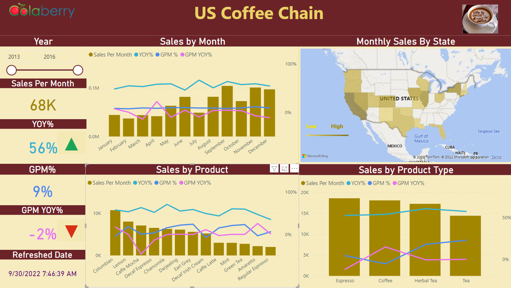

# Accidental Drug Related Deaths 2012-2021

## Project Overview

This project analyzed drug overdose deaths in Connecticut from 2012 to 2021 using Power BI to visualize trends by demographics and geography. It involved data preparation, DAX calculations, and creating interactive dashboards to highlight key patterns in overdose incidents. The insights support targeted public health strategies to address the opioid crisis.

---

## Business Problem

The United States experienced a record increase in drug overdose deaths in 2020, driven by illicit drug use with significant gender and age disparities. Public health agencies require detailed analytics to understand these trends and allocate resources effectively. There is a need to identify high-risk groups and regions to reduce overdose fatalities.

---

## Objective

- Import and prepare drug overdose data for analysis
- Create interactive visualizations to reveal demographic and geographic trends
- Provide actionable insights to support public health decision-making

---

## Tools & Technologies

- Power BI
- DAX
- Excel
- Data Warehousing
- ETL
- Microsoft Office
- Report Writing
- Data Analytics

---

## Project Workflow

- Import raw overdose data into Power BI
- Prepare and clean data including indexing and merging location fields
- Create DAX measures for key metrics like total deaths
- Design and format interactive dashboards with maps and charts
- Analyze trends by year, age, gender, and location

---

## Key Insights

- Men have higher rates of illicit drug use and overdose deaths than women across most age groups
- Overdose deaths increased sharply in 2020, marking the largest one-year rise recorded
- Certain geographic areas show higher concentrations of accidental drug-related deaths
- Women are equally likely as men to develop substance use disorders despite lower usage rates

---

## Final Dashboard / Project Preview

---

## Business Impact

- Enabled targeted resource allocation to high-risk demographics and regions
- Supported evidence-based public health policies to combat overdose deaths
- Improved stakeholder understanding of drug overdose trends through clear visualizations

---

## Portfolio Navigation

[← Back to Portfolio Home](../README.md)
